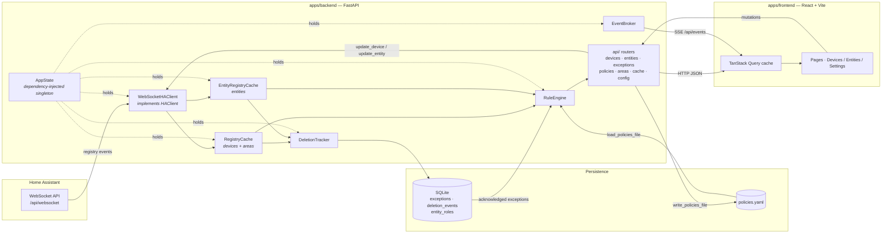

# Architecture

Diagrams for Home Curator. All Mermaid — they render on GitHub and diff in PRs.

| Doc | Diagram type | Answers |
| --- | --- | --- |
| [Data model](data-model.md) | ER + class | What is persisted, and how HA registry shapes become rule-engine shapes |
| [Rule engine](rule-engine.md) | Class | How a `policies.yaml` entry becomes a compiled rule that emits an `Issue` |
| [Live updates](live-updates.md) | Sequence | How an HA registry change reaches the browser |
| [Frontend](frontend.md) | Flowchart | Routes, hooks, and where server state lives |

> **Note on notation.** Optional types are written `str?` rather than `str | None` — Mermaid treats `|` as a delimiter. Python `Protocol` classes are drawn as `<<interface>>`; they are structural, not nominal, so implementations declare no base class in code.

## System overview

Read paths flow left-to-right; writes go back through `api/` → `HAClient` → HA, and HA echoes the change back as an event, which invalidates the frontend query cache. There is no optimistic local mirror of HA state — the cache is always downstream of HA.

## Why these diagrams and not a full class diagram

Most of the ~55 backend classes are flat data holders: Pydantic read/patch models, SQLAlchemy tables, frozen dataclasses. A UML box for each would restate `models.py` and rot on the first field addition.

Two places have real polymorphism and earn a class diagram: the `CompiledPolicy` protocol with its six implementations, and the `HAClient` protocol with its live and fake implementations. Both are in [rule-engine.md](rule-engine.md) and [live-updates.md](live-updates.md).

The frontend is function components and hooks, so its diagram is data flow, not classes.
