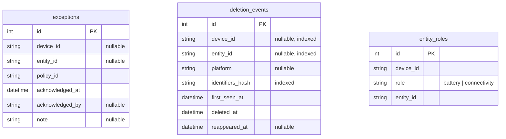
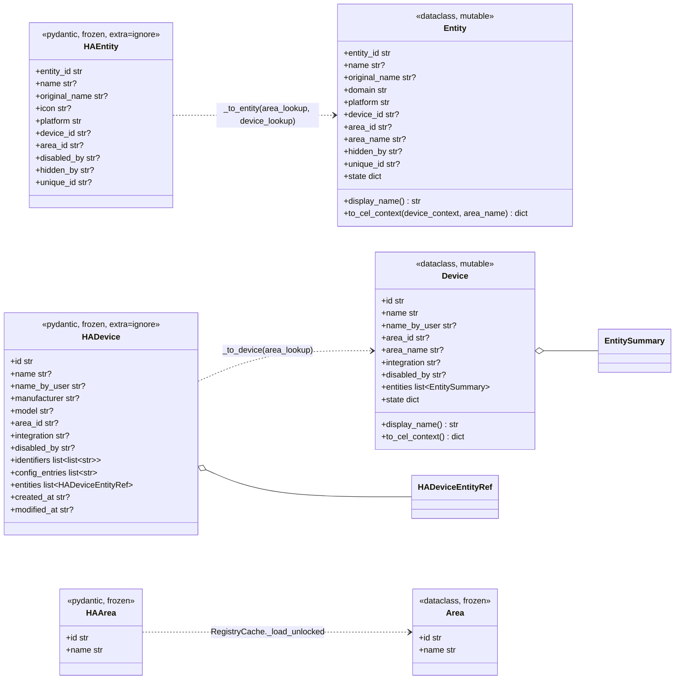

# Data model

Two distinct model layers, deliberately not shared:

1. **Persisted rows** — SQLAlchemy, in `storage/models.py`. Home Curator owns these.
2. **In-flight domain objects** — Pydantic at the HA boundary (`ha_client/models.py`), converted to dataclasses for rule evaluation (`rules/base.py`). HA owns the underlying truth; nothing here is persisted.

## Persisted schema

No foreign keys between these tables — every one of them points at a Home Assistant id that lives outside the database, so referential integrity is enforced by HA, not SQLite. What the schema *does* enforce:

| Constraint | Table | Meaning |
| --- | --- | --- |
| `ck_exceptions_target_exactly_one` | `exceptions` | `(device_id IS NULL) <> (entity_id IS NULL)` — a row targets a device **or** an entity, never both, never neither |
| partial unique index (Alembic) | `exceptions` | unique on `(COALESCE(device_id,''), COALESCE(entity_id,''), policy_id)` — one acknowledgement per target+policy |
| `ck_deletion_target_exactly_one` | `deletion_events` | same discriminated-target rule |
| `uq_entity_roles_device_role` | `entity_roles` | one battery entity and one connectivity entity per device |

`identifiers_hash` is what makes reappearance detection work across id churn. For devices it hashes the HA `identifiers` tuples; for entities it hashes `(platform, unique_id)`, falling back to `(platform, entity_id)` when the entity has no `unique_id`. A user-renamed entity keeps its identity; a re-paired device keeps its identity. Timestamps are stored via the `TZDateTime` type decorator so they round-trip as timezone-aware UTC through SQLite.

## HA boundary → rule-engine shapes

The conversion is where enrichment happens, and it carries three decisions worth knowing:

- **`area_name` is resolved at conversion time**, so rules never need the area map to render a message. For an entity, the *name* comes from the effective area (its own `area_id`, else the owning device's), but the stored **`area_id` stays the entity's own override** — otherwise `entity_missing_area` in strict mode could never fire.
- **`state` is a computed side-channel**, empty on construction and populated by `DeletionTracker` (e.g. `reappeared: True`). CEL policies see it under the key `_state` so expressions can tell computed fields apart from HA's own attributes.
- **`Device` and `Entity` are mutable**, unlike everything on the HA side. That is why `RegistryCache.refresh()` deep-copies the before-snapshot: a later mutation of `entities` or `state` would otherwise corrupt the diff it is comparing against.

Read models use `extra="ignore"` so a new HA field never raises; patch models (`HADeviceUpdate`, `HAEntityUpdate`) use `extra="forbid"` so a caller typo fails loudly instead of silently updating nothing.
