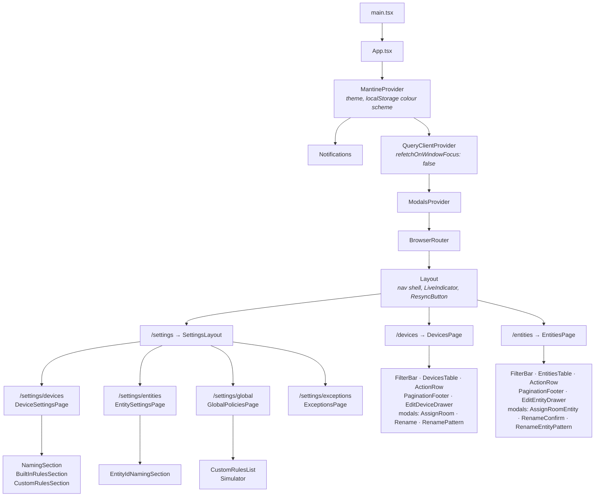
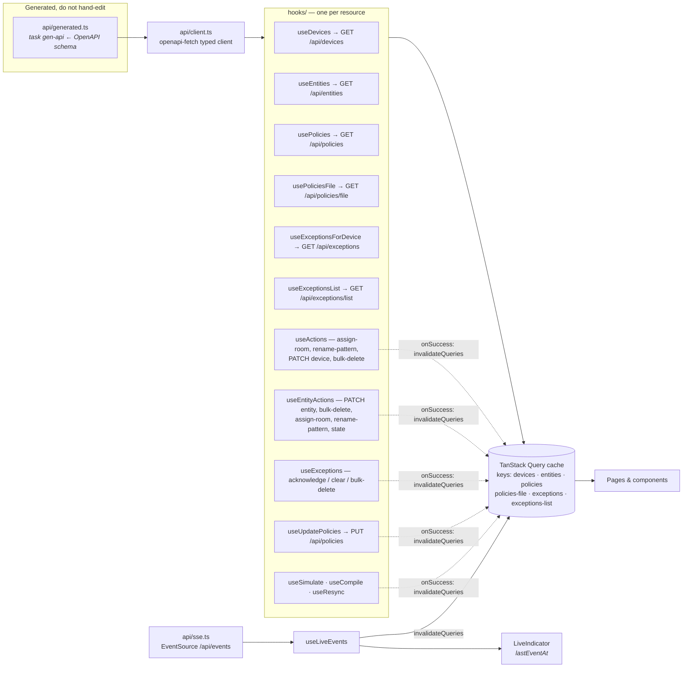
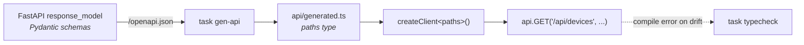
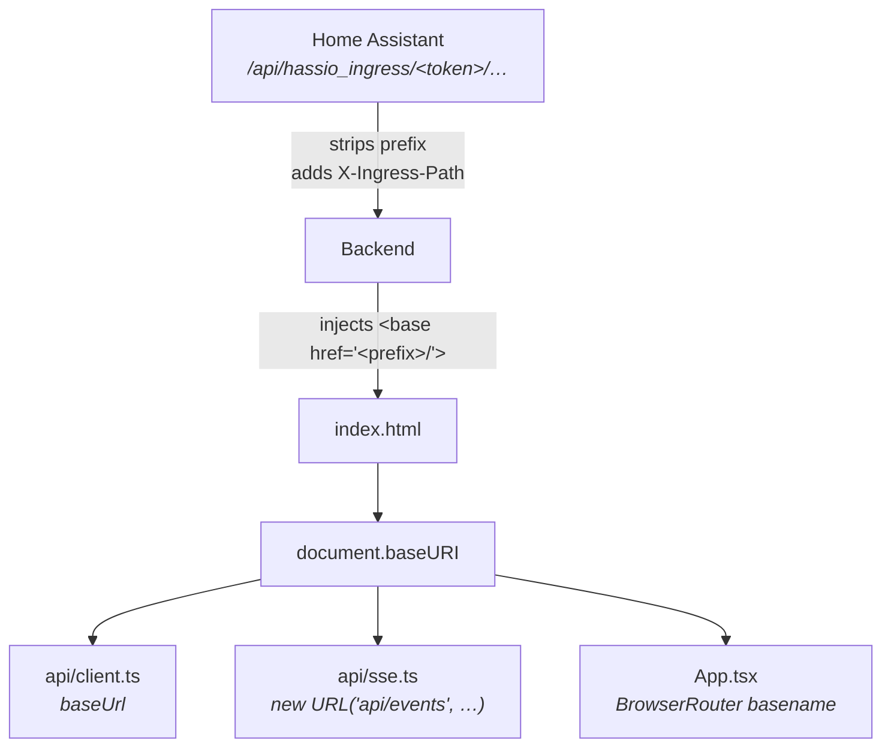

# Frontend

React 19 + Vite + Mantine, function components throughout. No classes, no Redux, no context-based store — **all shared state is server state**, held in the TanStack Query cache and keyed by endpoint. Local `useState` covers only ephemeral UI (filter inputs, modal open/close, selection).

That single decision explains most of the architecture: there is nothing to keep in sync, because there is only one copy of the data and it is a cache of the backend.

## Provider stack and routes

`/` redirects to `/devices`; `/settings` redirects to `/settings/devices`. `/settings/naming-conventions` is kept as a redirect to `/settings/devices` so old bookmarks don't 404.

Devices and Entities are deliberate near-mirrors of each other — same FilterBar / Table / ActionRow / PaginationFooter / Drawer decomposition — rather than one generic component parameterised over both. The columns, filters, and bulk actions diverge enough that the abstraction would cost more than the duplication.

## Data flow

Every mutation ends in `invalidateQueries` rather than a manual cache write, so a mutation and an SSE event take the identical refresh path. Invalidations deliberately cross resource boundaries where the backend couples them: acknowledging an exception invalidates `devices`, `entities` **and** `exceptions-list`, because an acknowledgement changes which issues those lists report. Saving policies invalidates `policies` and `devices` for the same reason.

`useDevices` and `useEntities` set `placeholderData: keepPreviousData`. Without it the `FilterBar` unmounts on every keystroke — stealing focus and flashing the table — because a changed query key would otherwise drop to a loading state.

`useLiveEvents` no-ops when `EventSource` is undefined, which is how the jsdom test environment runs pages without a live stream.

## The typed boundary

The frontend has no hand-written request or response types. `task gen-api` regenerates `generated.ts` from the running backend's OpenAPI schema, and `openapi-fetch` types paths, query params, and response bodies from it. A backend schema change that the frontend hasn't caught up to becomes a TypeScript error, not a runtime `undefined`.

This is why `gen-api` requires the backend to be up. `generated.ts` is **not** committed — it is gitignored and regenerated on demand. `npm run typecheck` runs `gen:api:local` first, which produces the schema in-process without booting a server, so CI still typechecks from a clean checkout.

## Base URL resolution and ingress

Every URL the app emits is resolved relative to `document.baseURI` rather than `window.location.origin`, because Home Assistant serves the add-on beneath a per-session path prefix (`/api/hassio_ingress/<token>/`) and strips that prefix before proxying.

An absolute `/api/devices` would reach the Home Assistant host rather than the add-on. A *relative* path is not sufficient either: at `<prefix>/settings/devices` it would resolve to `<prefix>/settings/api/devices`. The injected `<base href>` is absolute, so route depth stops mattering — which is why the backend (`api/spa.py`) injects it from the `X-Ingress-Path` header, and why Vite is configured with `base: "./"`.

Outside ingress the header is absent, the injected tag is `<base href="/">`, and all three consumers behave exactly as they did before: Vite proxies `/api` in dev, the packaged add-on serves from its own origin, and jsdom resolves against the test origin.

`fetch` is dereferenced from `globalThis` at call time so tests can spy on it.
