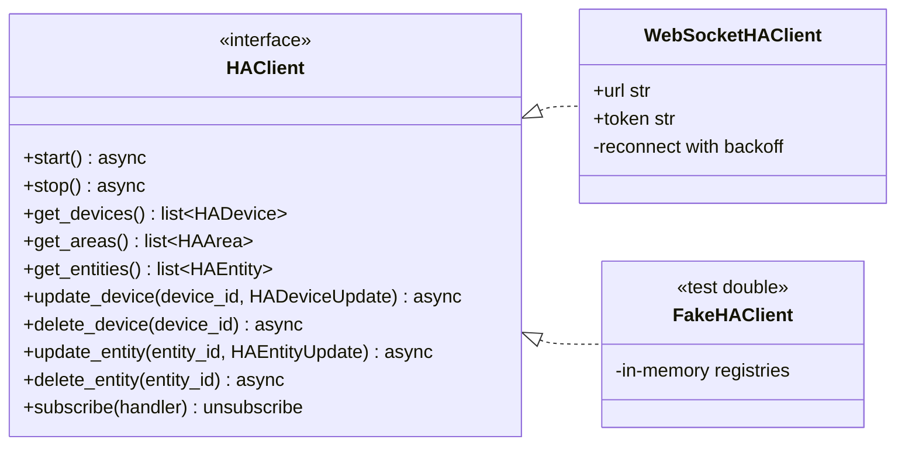
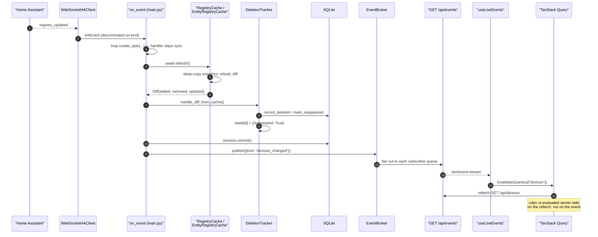
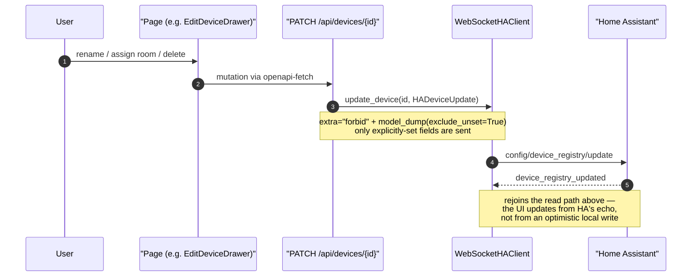

# Live updates

How a change in Home Assistant reaches the browser, and how a change made in the browser gets back.

## The HA client seam

This is the seam that makes the backend testable. `create_app(ha_client=...)` takes an injected client, so the entire integration suite runs against `FakeHAClient` with no HA instance and no network.

`subscribe` returns its own unsubscribe closure rather than exposing an `unsubscribe(handler)` method — the caller cannot leak a subscription by losing the handler reference, and `main.py`'s lifespan just calls `unsub()` on teardown.

## Events

`HAEvent` is a Pydantic discriminated union on `kind`:

| Event | Payload | Triggers |
| --- | --- | --- |
| `reconnected` | — | full device **and** entity refresh |
| `device_updated` | `device_id?` | device refresh |
| `area_updated` | — | device refresh (area names are denormalised onto devices) |
| `entity_updated` | `entity_id?` | entity refresh |
| `entity_deleted` | `entity_id?` | entity refresh |

The id fields are optional because HA emits broad registry-change events without one. `None` means "refresh everything in that scope" — the handler never assumes an id is present.

## HA change → browser

Four things this diagram is meant to make obvious:

- **`on_event` is synchronous and does no work.** It only schedules tasks on the running loop. HA's WebSocket read loop is never blocked by a database write.
- **The SSE payload carries no data**, only a `kind`. It is a cache-invalidation signal; the frontend always refetches through the normal REST endpoint. One code path for rendering, whether the trigger was a poll, a user action, or an HA event.
- **Rules are evaluated on read**, not on event. There is no stored issue table — `api/devices.py` runs `RuleEngine.evaluate` per request against current cache state.
- **`EventBroker` is a plain fan-out** over per-subscriber `asyncio.Queue`s using `put_nowait`, so a slow SSE client cannot block a publish.

## Safety resync

Events can be missed — a dropped socket, an HA restart, a registry change HA doesn't announce. `_safety_resync_loop` refreshes both caches every 5 minutes, runs both tracker diffs, commits, and publishes `devices_changed` / `entities_changed` **only if the corresponding diff is non-empty**, so a quiet system produces no SSE traffic. Failures are logged and swallowed; the loop never dies.

The same work is exposed on demand at `POST /api/resync`, driven by the frontend's `ResyncButton`.

## Browser change → HA

There is no optimistic update of the cache. The write goes to HA, HA echoes it back as an event, and the event drives the refresh. Slightly more latency, but the cache can never drift from HA by claiming a write succeeded when it didn't.

`None` in a patch model means "clear this field", which is why `exclude_unset=True` (not `exclude_none=True`) is what gets sent.

## Startup and teardown

`create_app`'s lifespan wires everything in dependency order: client → device cache → entity cache → session → tracker → broker → policies → rule engine → `AppState` → event subscription → resync loop → policy watcher.

Teardown ordering is load-bearing and duplicated in two places — a `BaseException` handler covering partial startup, and the `finally` after `yield` covering normal shutdown. Both unsubscribe, cancel the resync and watcher tasks, stop the client, close the session, and dispose the engine. Once `client.start()` has succeeded, any later failure **must** stop the client before re-raising, or a live WebSocket leaks.

`AppState` is a mutable dataclass on `app.state.store`, read by routers through the `app_state` FastAPI dependency. Most fields are set once at startup; three are reassigned at runtime — `engine`, `policies_file`, and `policies_error`, on policy reload.
