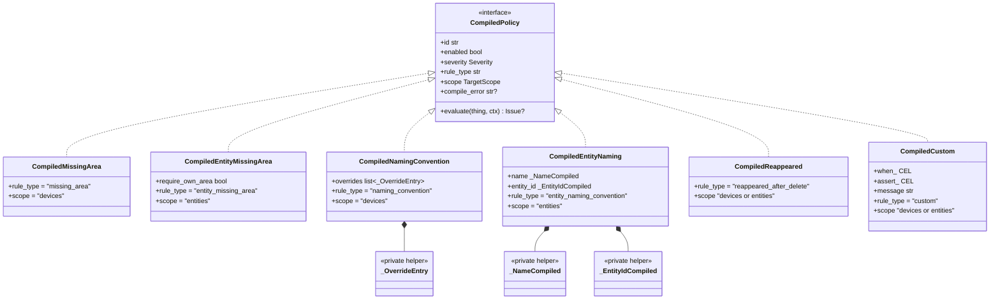
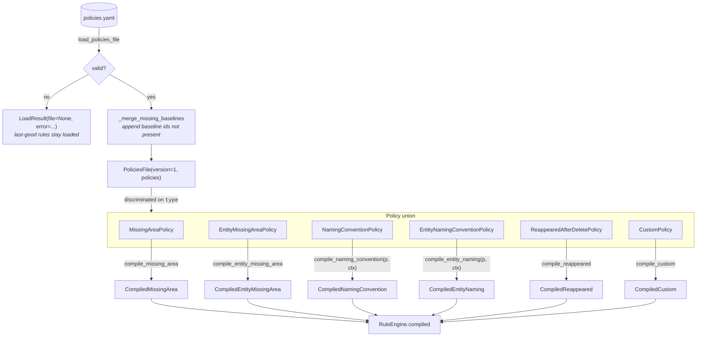
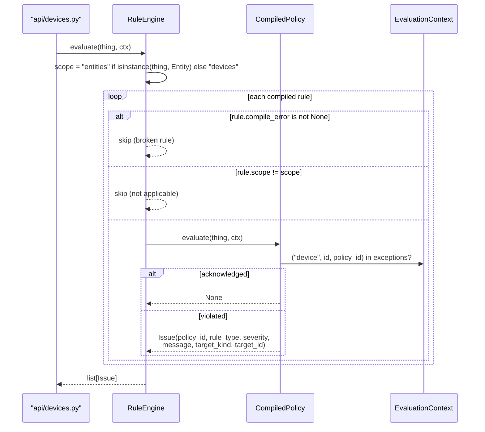

# Rule engine

The one place in the backend with genuine polymorphism. A YAML policy is parsed into a validated Pydantic model, *compiled* into a dataclass that satisfies the `CompiledPolicy` protocol, and then evaluated against every `Device` or `Entity`.

Parse and compile are separate on purpose: schema validation catches malformed config at load, while compilation catches things only knowable later (a bad CEL expression, an override naming an area that doesn't exist). A compile failure is recorded on the rule as `compile_error` rather than raised, so one broken rule cannot take down the other five.

## Compiled policies

`CompiledPolicy` is a `runtime_checkable` `Protocol`, so none of these six declare it as a base class — they satisfy it structurally. `rule_type` and `scope` are plain dataclass fields with defaults, not properties, which is why they show as `= "value"` above.

`scope` is fixed for four rules and configurable for two. `reappeared_after_delete` takes its scope from the policy (defaulting to `devices`, preserving pre-entity configs) and `custom` takes it from `CustomPolicy.scope`.

## Schema → compiled

`RuleEngine.compile` dispatches on `isinstance` and raises `TypeError` on an unhandled policy type — adding a seventh policy without a compile branch fails loudly at startup rather than silently skipping.

The two naming compilers take `ctx` because room overrides may reference an area by *name*; they resolve it to an `area_id` at compile time so evaluation is a dict lookup.

## Evaluation

Three filters run in order, and the ordering matters: broken rules are skipped before scope, scope before evaluation, and the per-rule `enabled` check happens inside `evaluate` (so a disabled rule still counts as compiled and is still reported by `compile_errors()`).

`EvaluationContext.exceptions` is a set of **3-tuples** `(target_kind, target_id, policy_id)`. The `target_kind` discriminator is what lets a device and an entity share an id without their acknowledgements colliding. `Issue` mirrors that shape with `target_kind` + `target_id`, so downstream consumers route an issue without inferring its kind from `rule_type`.

`EvaluationContext.devices_by_id` is only populated for entity-scope rules that need the owning device — `custom_cel` (to build `entity.device` context) and `entity_missing_area` in lenient mode. It defaults to empty so device-only callers need not supply it.

## Reload

`policies/watcher.py` watches the *parent directory* via `watchfiles.awatch` (editors write-and-rename, so watching the file alone misses changes). On change, `reload_policies` re-reads, rebuilds `EvaluationContext` from a fresh session, recompiles, and publishes `policies_changed`. If the new file is invalid, `policies_error` is set and **the previously compiled rules stay live** — a typo in the editor never blanks the UI's issue list.
